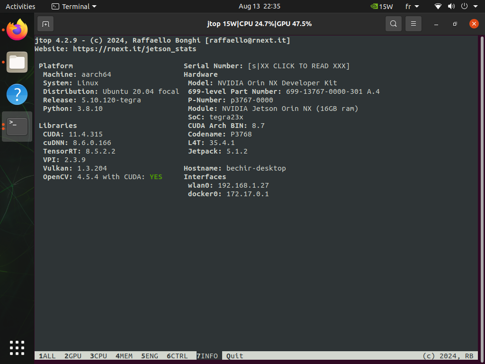

## Solar PV Anomaly Detection
# ReComputer J4012




# Freezing Backbone Layers in Hybrid Model

To freeze the backbone layers of the Hybrid Model, which includes ResNet and Xception add the following lines of code after initializing ResNet and Xception:

```shell

for param in self.resnet.parameters():
    param.requires_grad = False


# Freeze Xception layers
for param in self.xception.parameters():
    param.requires_grad = False
```
# DeepStream Application

To run a DeepStream application on a Jetson device with optimized performance and speed, follow these steps:


To maximize the performance and power of your Jetson device, set the clocks to high:
```shell

sudo nvpmodel -m 0  # Set to MAX performance and power mode
sudo jetson_clocks  # Apply the high performance clock settings
```
Convert YOLOv10 to ONNX and TensorRT

1. Convert YOLOv10 (trained model) to ONNX format:
```shell

   python3 export_yoloV10.py --weights IRdetection.pt
```
2. Optimize the ONNX model with TensorRT and enable DLA (Deep Learning Accelerator) support:
```shell

   trtexec --onnx=IRdetection.onnx --fp16 --useDLACore=0 --saveEngine=IRdetection.engine --allowGPUFallback
```
To analyze and dump the detailed information about the layers in TensorRT engine use :
```shell

  trtexec --loadEngine=IRdetection.engine --dumpLayerInfo

```

Run DeepStream Application

To run the DeepStream application with the optimized TensorRT model, use the following command:
```shell

deepstream-app -c deepstream_app_config.txt

```
Or Convert YOLOv10 to ONNX format and then use DeepStream to build your engine from the ONNX file for GPU usage(You can configure the engine parameters in the config_infer_primary_yoloV10.txt file):
```shell

python3 export_yoloV10.py --weights IRdetection.pt

deepstream-app -c deepstream_app_config.txt

```

